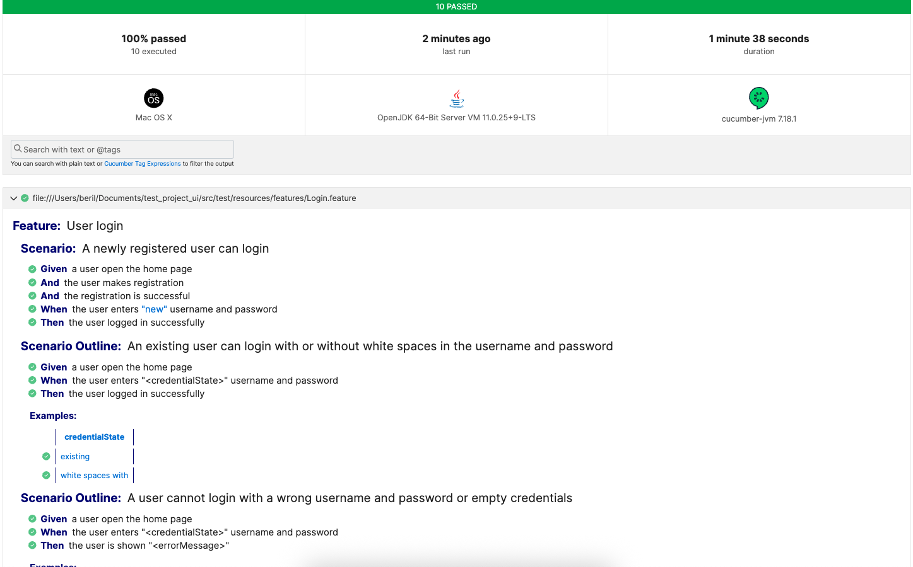

# UI Automation Project – Login Feature

## 📌 Overview
This project automates the **Login** feature of ParaBank web application using **Java**, **Selenium WebDriver**, and **Cucumber**.  
It follows the **Page Object Model (POM)** design pattern and includes **10 test cases** (positive and negative scenarios) to ensure complete coverage of the login functionality.

---

## ✅ Features
- **10 automated test cases** covering:
- Positive:
1) A newly registered user can login
2) Existing user can login
3) User can login even after putting white space after username and password
4) User can view login credentials by entering correct personal info

 - Negative:
 1) User cannot login when wrong username and password are entered
 2) User cannot login when wrong username is entered
 3) User cannot login when wrong password is entered
 4) User cannot login when no username and password is entered
 5) User cannot view username and password when all personal info isn't provided
 6) User cannot view username and password when no personal info is provided
    
  ---

## 🏗 Design Pattern  
- **Page Object Model (POM)** is used to structure the project
- **Cucumber BDD** is used for  more readable test scenarios

---

## 🛠 Tech Stack
- **Java**
- **Selenium WebDriver**
- **Cucumber**
- **JUnit**
- **Maven**

---

## ▶️ Execution
Tests can be executed using the Runner file. To run the tests in headless mode headless parameter in configuration properties file needs to be set **true**. 

---

## 📊 Reporting
Each execution produces a new report under **target** with the name **default-cucumber-reports.html**. When this file is opened in a browser a nicely structured report of the test results can be viewed. 

